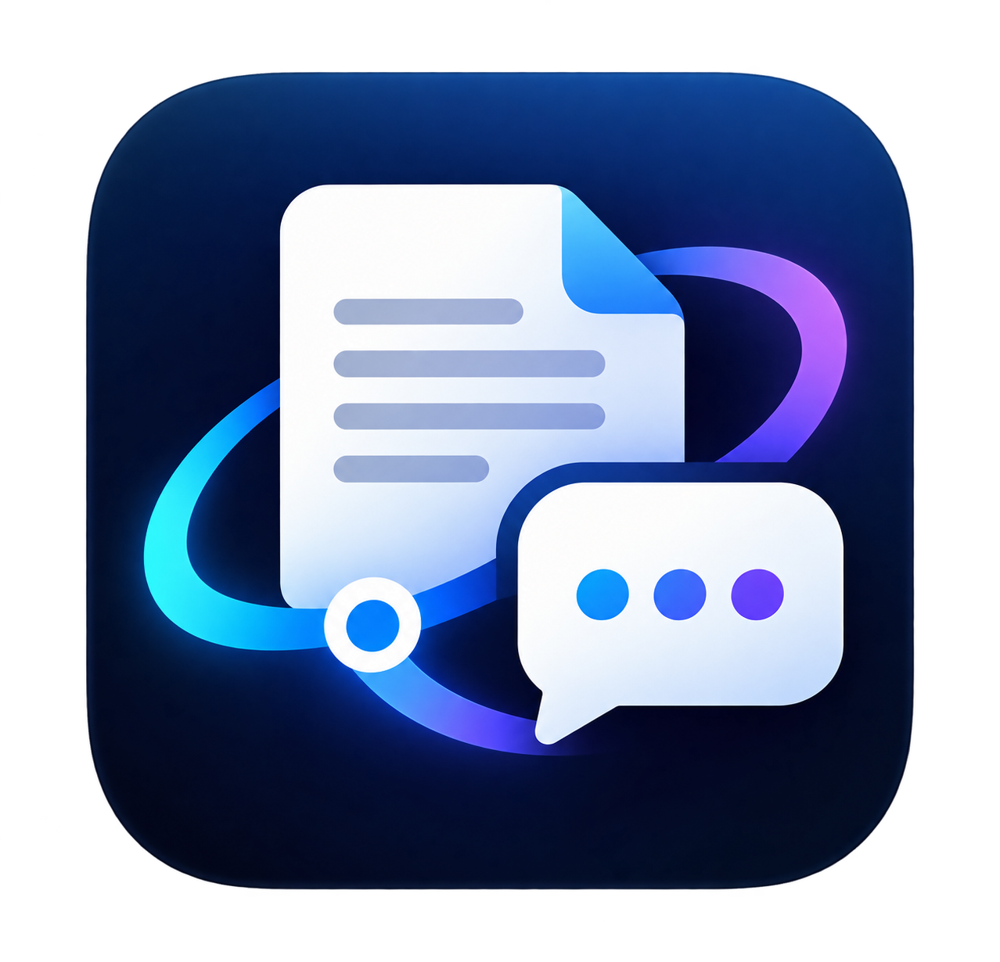
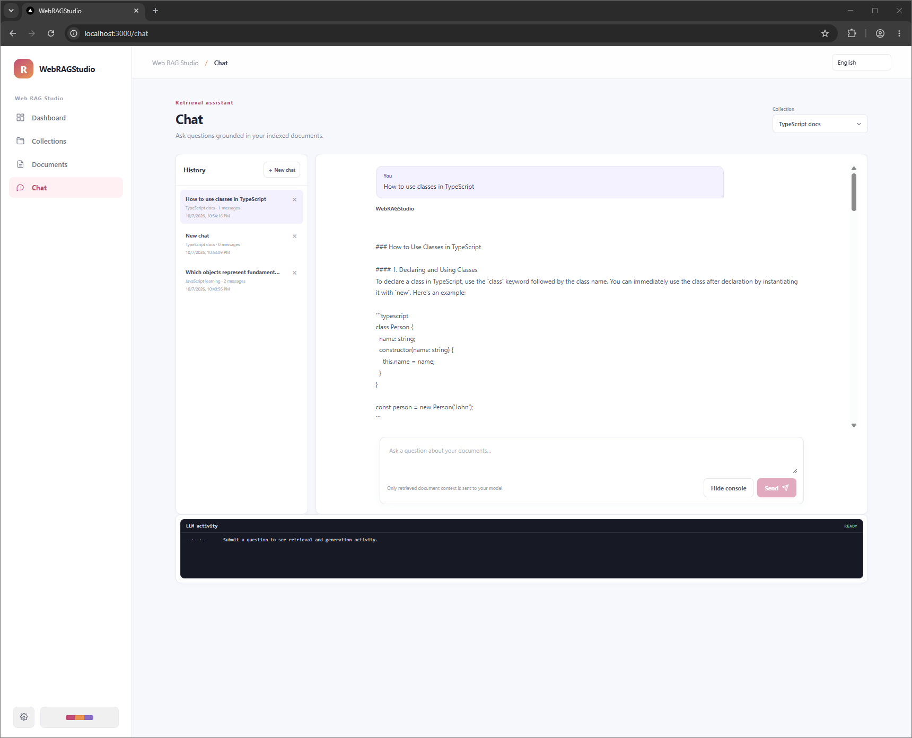

# WebRAGStudio

<p align="center">
  
</p>

> A simple, self-hosted RAG workspace for chatting with your own documents.

<p align="center">
  
</p>

<p align="center"><em>More screens: <a href="SCREENSHOTS.md">dashboard, collections, documents, and settings</a>.</em></p>

WebRAGStudio lets you index your documents locally and chat with them using OpenAI, Ollama, or any OpenAI-compatible LLM. It runs as one Next.js application and stores all data in a local SQLite database — no vector DB, no SaaS, no accounts.

- 🏠 Self-hosted — your own Next.js app, your own machine
- 🔒 Local SQLite storage — documents, chunks, embeddings, and chat history stay on disk
- 🤖 OpenAI / Ollama / OpenAI-compatible APIs — one provider adapter, separate chat and embedding models
- 📄 PDF, DOCX, TXT, Markdown, CSV, JSON — upload or paste text, indexed through the same pipeline
- 🔍 Vector similarity search — cosine similarity over stored embeddings, no extra infrastructure
- 💬 Streaming chat with retrieved sources — see which passages backed each answer
- ⚡ Next.js + TypeScript — a single app, nothing to orchestrate
- 🪶 Single-user and intentionally simple — no auth, no multi-tenancy, no background services

## Why?

I wanted a small RAG application that I could run myself without deploying a complicated vector database or SaaS platform.

WebRAGStudio keeps the architecture deliberately simple:
documents → chunks → embeddings → SQLite → similarity search → LLM.

## Features

- Create, rename, and delete collections.
- Index text, PDF, DOCX, TXT, Markdown, CSV, and JSON documents. Uploads are limited to 10 MB.
- Split text into configurable word-based chunks, embed each chunk, and store the text and embedding in SQLite.
- Retrieve passages with cosine similarity and send only the selected passages to chat.
- Stream answers, show retrieved source titles, and keep chat sessions locally.
- Configure chat and embedding models separately. OpenAI, Ollama, and OpenAI-compatible endpoints use the same provider adapter.
- Configure the provider in Settings or through environment variables.

## Requirements

- Node.js 22.5 or newer (the application uses Node's built-in `node:sqlite`).
- pnpm (preferred), or npm.
- An embedding model and chat model exposed by OpenAI, Ollama, or an OpenAI-compatible service.

## Install and run

```bash
git clone <repository-url>
cd WebRAGStudio
pnpm install
pnpm dev
```

Open <http://localhost:3000>. The database and generated settings encryption key are created under `data/` on first use. There is no separate migration command; the `db:push` script is currently an informational compatibility stub.

To create a production build and run it:

```bash
pnpm build
pnpm start
```

Use `npm install`, `npm run dev`, and corresponding `npm run <script>` commands if you use npm. Keep only the repository's existing `pnpm-lock.yaml`; do not add another lockfile.

## First use

1. Open **Settings** and configure the provider, chat model, embedding model, and base URL. API keys can be left blank for local services that do not require them.
2. Save the settings, then create a collection from **Collections**.
3. Open the collection and upload a supported file, or create a text document. Indexing runs synchronously; successful documents show `READY`.
4. Open **Chat**, select the collection, ask a question, and review the retrieved source titles below the answer.

Uploads and pasted text share the same chunking, embedding, and storage pipeline. If indexing fails, check that the embedding provider is reachable and that its model supports embeddings. The chat model must support streaming chat completions.

An embedding model converts document chunks and a user's question into vectors (lists of numbers) that represent their meaning. The app compares those vectors to find relevant passages for retrieval; the chat model then uses those passages to generate the answer. In the Ollama setup below, `qwen3-embedding:8b` is used for indexing and retrieval.

## Provider setup

The Settings page is the easiest way to configure a provider. Chat and embeddings have separate model names, but share a provider connection (provider, base URL, and API key). Environment variables are read as defaults; saved settings take precedence.

### OpenAI

In Settings choose `openai`, set the base URL to `https://api.openai.com/v1`, enter an API key, and select compatible chat and embedding models. Or set `LLM_PROVIDER`, `LLM_MODEL`, `LLM_BASE_URL`, `LLM_API_KEY`, and corresponding `EMBEDDING_*` values in your local `.env.config`.

### Ollama

Install and start Ollama, then pull an embedding model, for example:

```bash
ollama pull qwen3-embedding:8b
```

Choose provider `ollama`, base URL `http://localhost:11434`, and the model names you pulled. The app adds the OpenAI-compatible `/v1` endpoint automatically. Leave the API key blank unless your Ollama endpoint requires one.

`qwen3-embedding:8b` has been tested for RAG indexing and chat workflows as the embedding model. Select a chat model separately in Settings to generate responses using the retrieved passages.

### Other compatible services

For vLLM, LM Studio, or another OpenAI-compatible server, choose `openai-compatible` and enter its `/v1` base URL (for example `http://localhost:8000/v1`), model names, and optional key. The server must provide both chat completions and embeddings for the selected use case.

## Configuration and data

The app reads environment variables from a local `.env.config`; Next.js also reads `.env.local`. `.env.config` is ignored by Git, so create it locally if it is not present in your checkout. Configure the provider variables described above or use the Settings page. Shell/container variables take precedence over `.env.config`. Do not commit environment files or keys.

Data is stored locally:

- `data/rag-studio.sqlite`: collections, document text metadata, chunks, embeddings, settings, and chat history.
- `data/settings.key`: generated encryption key for provider keys saved in Settings.

Back up both files together. If you set `SETTINGS_ENCRYPTION_KEY`, keep its value stable and secure. Removing or changing the key prevents decryption of saved provider keys. Deleting the SQLite file removes the local app data. The app has no authentication, so keep it on a trusted machine or behind your own access control before exposing it to a network.

## Development

```bash
pnpm dev
pnpm lint
pnpm typecheck
pnpm test
pnpm build
```

`pnpm test` uses Node's test runner. The project currently has no automated test suite, so a successful command does not imply end-to-end coverage. See [CONTRIBUTING.md](CONTRIBUTING.md) for the maintenance workflow and manual smoke checks.

## Current scope

The current implementation uses Node's built-in synchronous SQLite API and stores embeddings as JSON arrays, with cosine similarity calculated in application code. It does not use Drizzle, a dedicated vector extension, PDF page-level citations, background jobs, or provider-specific Anthropic/Azure/Bedrock adapters. Keep documentation aligned with implemented behavior as these areas change.

## License

MIT. See [LICENSE](LICENSE).
